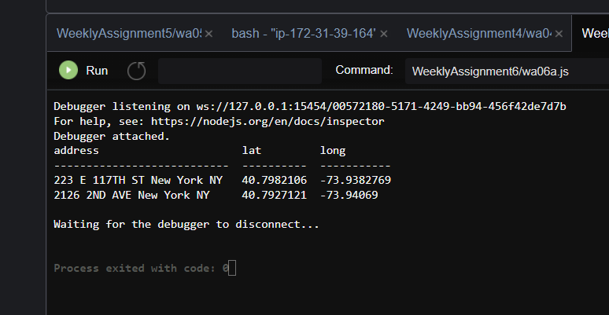
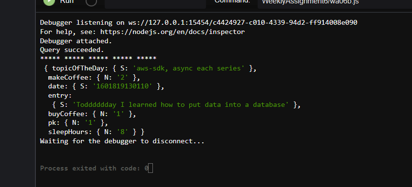

# Weekly Assignment 6
Write and execute queries for both PostgreSQL AA database and Diary DynamoDB. 

# Files
README.md
wa06a.js
wa06b.js
AAQuery.PNG
ProcessBlogQuery.PNG

## Part 1: Write and execute an SQL Query for AA database.  

[SQL query](https://www.postgresql.org/docs/9.4/queries.html) 
[[helpful SQL query overview](https://beginner-sql-tutorial.com/sql-select-statement.htm)]


1.	The following query is working with a table constructed from :
```
var thisQuery = "CREATE TABLE aalocations (Address varchar(125), lat double precision, long double precision);"; 
```
2.	 Load modules and database credentials: 
```const dotenv = require('dotenv');
const { Client } = require('pg');
const cTable = require('console.table');
dotenv.config({path: '../.env'});

// AWS RDS POSTGRESQL INSTANCE
var db_credentials = new Object();
db_credentials.user = 'dalbed349';
db_credentials.host = 'data-structures-20.ckg3d7ssdboe.us-east-1.rds.amazonaws.com';
db_credentials.database = 'aa';
db_credentials.password = process.env.AWSRDS_PW;
db_credentials.port = 5432;
```
3. line 15-16 connect to database
```
const client = new Client(db_credentials);
client.connect();
```
4. line 20 Select a query based on latitude:
  ```
   var thisQuery = "SELECT Address, lat, long FROM aalocations WHERE lat<40.8;";
```


  5. Full capture of pg module to connect query to database: 
```
const client = new Client(db_credentials);
client.connect();


//var thisQuery = "SELECT Address, lat, long FROM aalocations WHERE lat>40.8;";
           var thisQuery = "SELECT Address, lat, long FROM aalocations WHERE lat<40.8;";

client.query(thisQuery, (err, res) => {
    if (err) {throw err}
    else {
        console.table(res.rows);
        client.end();
    }
});
```
6. Above code produces the result found in AAQuery.png. Address locations are only shown if their latitude is less than 40.8. 


## Step 2: Write and execute a  [query](https://docs.aws.amazon.com/amazondynamodb/latest/APIReference/API_Query.html)  for Diary data in DynamoDB.

1. Load modules. Important to get aws-sdk . 
```
// npm install aws-sdk
var AWS = require('aws-sdk');
AWS.config = new AWS.Config();
AWS.config.region = "us-east-1";

var dynamodb = new AWS.DynamoDB();
```
2.  lines 8-10 Create params variable which references the NAME of the table in the database. KeyConditionExpression is the PRIMARY key set up on database creation. If I want to change anything I must refer to wa05 and creation of DB. 
```
var params = {
    TableName : "processblog",
    KeyConditionExpression: "pk = :thisPk",
```
3. lines 16-17 are what we want to query within specified primary key. All primary key's labeled 1.  
```
  ExpressionAttributeValues: { // the query values
        ":thisPk": {N:"1"}
```
4. line 23 begins the query code which is not changed from the starter code. It is important to note that we are passing params through the db query and returning data with a for each loop. 
```
dynamodb.query(params, function(err, data) {
    if (err) {
        console.error("Unable to query. Error:", JSON.stringify(err, null, 2));
    } else {
        console.log("Query succeeded.");
        data.Items.forEach(function(item) {
            console.log("***** ***** ***** ***** ***** \n", item);
        });
    }
});
```

5. The output of this query is found in ProcessBlogQuery.PNG. I filter by the first item on my primary key and it is returned. Still thinking about a better way to organize my blog by pk and sk. 
